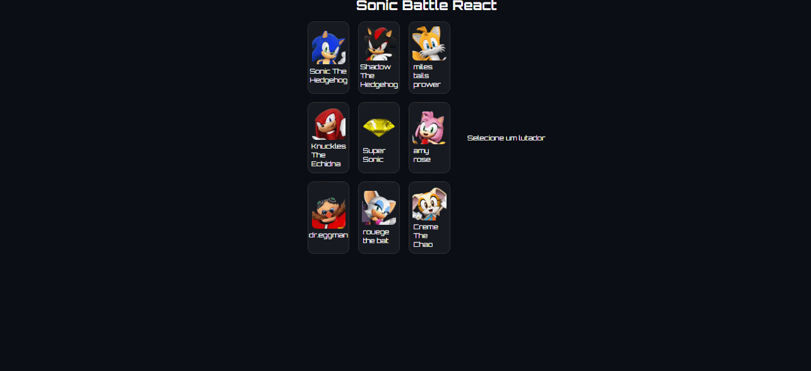

# 🎮 Sonic Battle Universe

<p align="center">
 # 🎮 Sonic Battle Universe

<p align="center">
  
</p>

🔗 **Deploy:** https://felipegdasilva.github.io/Sonic-Battle-Universe/

Interface interativa inspirada em telas de seleção de personagens de jogos, desenvolvida com **React** e focada em componentização, interatividade e organização de código.

---

## 🧠 Funcionalidades

- 🎮 Seleção dinâmica de personagens
- 📌 Atualização de informações em tempo real
- 🔊 Reprodução de sons por personagem
- 🎨 Interface estilizada com CSS e temas

---

## 🛠️ Tecnologias utilizadas

- React.js
- JavaScript (ES6+)
- HTML5
- CSS3

---

## 💻 Como rodar o projeto localmente

1. Clone o repositório:
```bash
git clone https://github.com/FelipeGdasilva/Sonic-Battle-Universe.git

🔗 **Deploy:** https://felipegdasilva.github.io/Sonic-Battle-Universe/

Interface interativa inspirada em telas de seleção de personagens de jogos, desenvolvida com **React** e focada em componentização, interatividade e organização de código.

---

## 🧠 Funcionalidades

- 🎮 Seleção dinâmica de personagens
- 📌 Atualização de informações em tempo real
- 🔊 Reprodução de sons por personagem
- 🎨 Interface estilizada com CSS e temas

---

## 🛠️ Tecnologias utilizadas

- React.js
- JavaScript (ES6+)
- HTML5
- CSS3

---

## 💻 Como rodar o projeto localmente

1. Clone o repositório:
```bash
git clone https://github.com/FelipeGdasilva/Sonic-Battle-Universe.git

2. Acesse a pasta do projeto:
cd Sonic-Battle-Universe

3. Instale as dependências:
npm install

4.Execute o projeto:
npm run dev


