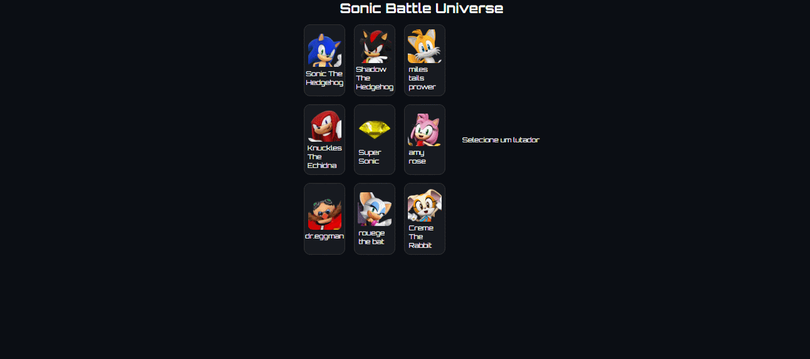

# 🎮 Sonic Battle Universe

<p align="center">
  <table align="center">
    <tr>
      <td align="center">
        <p><b>🔙 Antes (Versão Inicial)</b></p>
        
      </td>
      <td align="center">
        <p><b>🚀 Depois (Versão Atual)</b></p>
        
      </td>
    </tr>
  </table>
</p>

<p align="center">
  🔗 <b>Deploy:</b> <a href="https://felipegdasilva.github.io/Sonic-Battle-Universe/">Acesse o Projeto Aqui</a>
</p>

Interface interativa inspirada em telas de seleção de personagens de jogos clássicos. Este projeto foi desenvolvido com **React** focado em componentização, interatividade em tempo real e manipulação dinâmica de estilos (CSS Variables).

---

## 🔄 Evolução do Projeto

Nesta nova versão, o foco foi sair de um layout estático para uma experiência de "Game Feel" real:

| Característica | Antes (v1.0) | Agora (v2.0) |
| :--- | :--- | :--- |
| **Interatividade** | Layout fixo sem resposta ao clique. | Seleção dinâmica com alteração de tema global. |
| **Áudio** | Sons se sobrepunham ao clicar rápido. | Sistema inteligente que pausa o anterior antes do novo play. |
| **Visual** | Cores de fundo padrão para todos. | Cores dinâmicas (`--cor-tema`) que mudam conforme o personagem. |
| **Código** | Componentes sobrecarregados. | Refatoração limpa em `CharacterCard`, `CharacterInfo` e `Home`. |

---

## 🧠 Funcionalidades

- 🎮 **Seleção Dinâmica:** Clique no card e veja toda a interface se adaptar.
- 📊 **Status Progressivo:** Barras de estatísticas com transições suaves de largura.
- 🔊 **Sound Design:** Cada personagem possui seu tema sonoro exclusivo com controle de mute.
- 🎨 **Tematização Automática:** O fundo e os brilhos da interface mudam de cor dinamicamente via JS/CSS.

---

## 🛠️ Tecnologias Utilizadas

- **React.js** (Hooks: `useState`, `useEffect`)
- **JavaScript (ES6+)** (Manipulação de DOM e Áudio)
- **CSS3** (Flexbox, Grid e Variáveis CSS)
- **Vite** (Build tool rápida)

---

## 💻 Como rodar o projeto localmente

```bash
# 1. Clone o repositório
git clone [https://github.com/FelipeGdasilva/Sonic-Battle-Universe.git](https://github.com/FelipeGdasilva/Sonic-Battle-Universe.git)

# 2. Acesse a pasta do projeto e instale as dependências
cd Sonic-Battle-Universe
npm install

# 3. Execute o projeto em modo de desenvolvimento
npm run dev


